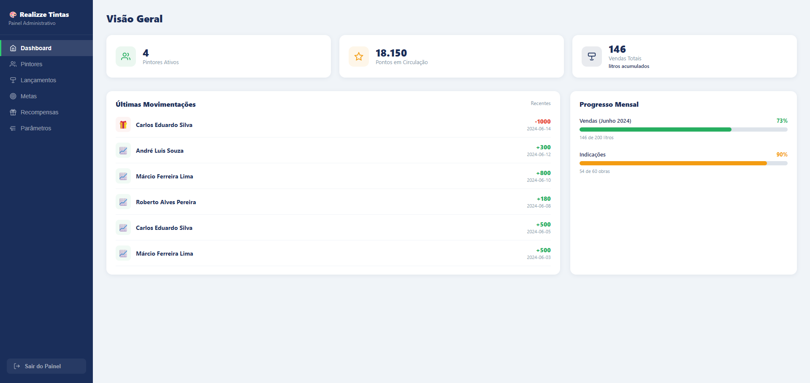

# 🏆 Sistema de Parceiros Realizze

## 📸 Preview

## 📖 Sobre o Projeto

Sistema desenvolvido para gerenciamento e acompanhamento de parceiros comerciais, permitindo o controle de pontuações e campanhas de incentivo.

---

## 🎯 Objetivo

Facilitar a gestão dos parceiros e fornecer maior transparência no acompanhamento das pontuações e benefícios.

---

## ⚙️ Funcionalidades

- Cadastro de parceiros
- Consulta de pontuação
- Controle de campanhas
- Visualização de resultados
- Interface amigável

---

## 🛠️ Tecnologias Utilizadas

- HTML
- CSS
- JavaScript

---

## 🚀 Benefícios

- Organização das informações
- Redução de controles manuais
- Maior transparência para os parceiros
- Facilidade de acompanhamento

---

## 👨‍💻 Desenvolvedor

Julio Meneghette
